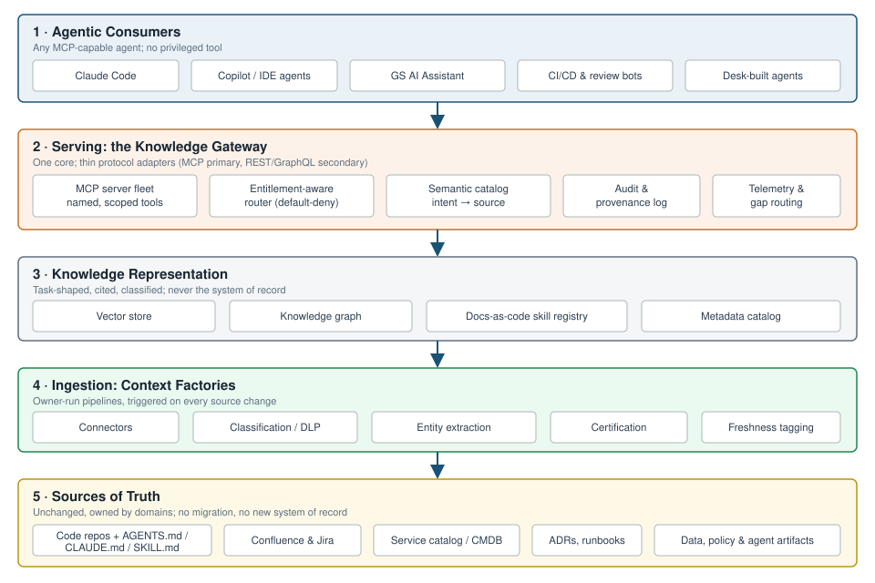
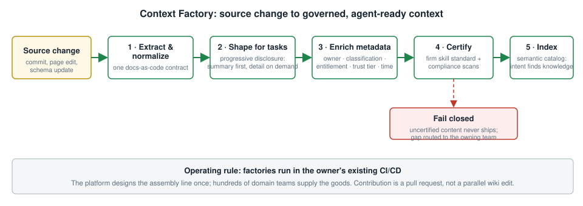
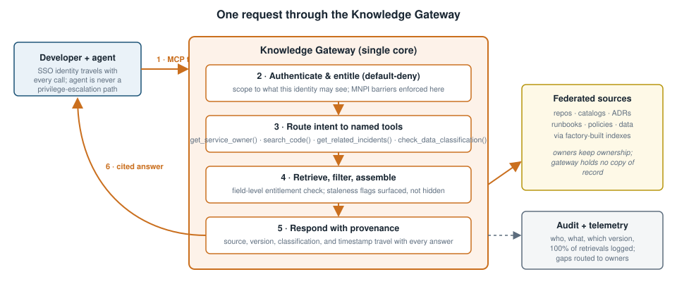
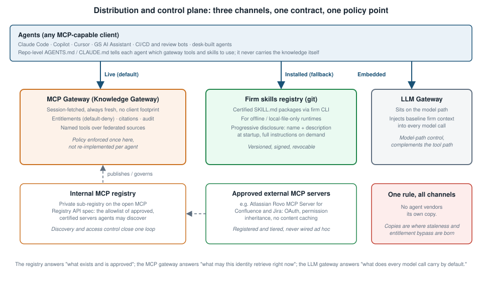
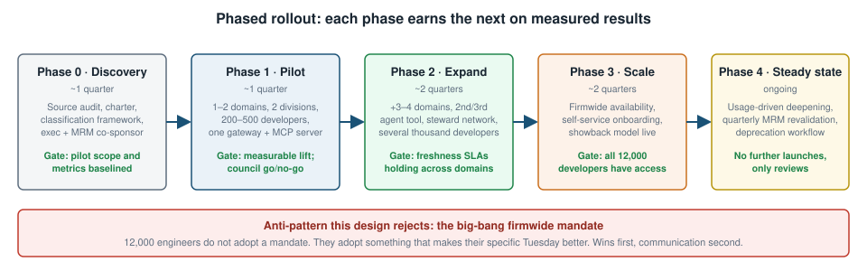

# The AI Knowledge Layer

## Firm Context as a Governed Service for Financial Institutions

**A white paper on the data sources, ingestion pipelines, distribution channels, and governance of a federated knowledge platform for AI agents in banking**

*Enterprise Architecture, Developer Knowledge Layer Initiative*
*August 2026 · Classification: Internal · v2, revised for depth on sources, ingestion, and distribution · Draft for Managing Director and Partner review; general Engineering distribution to follow*

---

## Executive summary

Frontier models are converging in capability and collapsing in price. What does not converge, and what no vendor can supply, is the firm's own knowledge: who owns a service, why a system was built the way it was, what a control requires, what already broke last time. Every AI agent operating inside a bank is only as good as the firm knowledge it can reach at the moment it acts. Without that reach, agents are fluent but ignorant: technically correct output that duplicates an existing service, crosses an ownership boundary, or violates a control nobody told the model about.

The industry has already voted on whether this matters. Morgan Stanley's GPT-4 assistant over its curated research corpus reached active use by more than 98 percent of advisor teams [1]. JPMorgan's LLM Suite is deployed to over 200,000 employees, with the firm attributing between one and a half and two billion dollars of measurable value to its AI portfolio [2][3]. Our own firm has moved a generative assistant from a 10,000-person pilot to roughly 46,000 employees [4]. In every one of these deployments, the differentiating asset was not the model. It was the quality, governance, and freshness of the proprietary knowledge behind it.

Meanwhile the interface layer beneath agents has standardized in the open, and faster than most planning cycles assumed. The Model Context Protocol (MCP) now sits under the Linux Foundation with an official registry [11][25]; Anthropic's Agent Skills format became an open standard in December 2025 and was adopted within weeks by OpenAI, Google, GitHub Copilot, and Cursor [27][28]; and AGENTS.md, the repo-level agent instruction file, is stewarded by the same foundation and present in more than 60,000 repositories [30]. These are no longer vendor features. They are the substrate the knowledge layer must be built on, and, equally important, they are themselves new classes of firm knowledge that must be ingested and governed.

This paper proposes that the firm treat context as a permanent internal platform with a standing owner, a governed contract, and a protocol-neutral interface: the AI Knowledge Layer. Relative to the prior draft, this revision goes materially deeper on three things leadership must fund correctly the first time: the full inventory of data sources including the Atlassian estate and the fast-growing family of agent-native artifacts; the ingestion pipelines that turn each source class into governed context; and the distribution plane, including the internal MCP registry, the MCP gateway, and its relationship to the firm's existing LLM gateway.

---

## 1. The problem: a context bottleneck, not a model bottleneck

Three structural facts define the moment.

**First, models are commoditizing while context is not.** The firm already routes across models from multiple frontier labs [4]. Switching costs at the model layer are falling by design. The remaining scarce input to agent quality is governed, current, task-shaped firm knowledge, and today no shared mechanism serves it to machines.

**Second, every agent currently wires into knowledge on its own.** A vendored snapshot here, a Confluence scrape there, a hand-maintained system prompt elsewhere. The costs compound with agent count:

- **Inconsistent answers.** The same question, asked through different tools, returns different answers, with no way to establish which is authoritative.
- **N x M integration spend.** Every new agent re-pays for authoring, indexing, freshness, and entitlements that another team already funded. Without a registry and gateway, every agent-to-tool connection is configured manually, reproducing the point-to-point sprawl of the pre-API-gateway era [26].
- **Ungoverned reach.** Where retrieval is bespoke, so are access control, provenance, and audit. Each bespoke path is a separate supervisory conversation.
- **Silent staleness.** Copies drift from the owner's source of truth until an agent is confidently wrong. In production code, confidently wrong is worse than silent.

**Third, the supervisory perimeter has already moved.** Model risk guidance in the United States, anchored historically by SR 11-7 and now by the revised interagency Model Risk Management guidance issued jointly by the Federal Reserve, OCC, and FDIC in May 2026, applies to generative AI systems with full force [5][6]. Examinations of AI programs consistently surface the same gaps: incomplete inventories that miss shadow deployments, insufficient validation, inadequate drift monitoring [6]. A firm with forty bespoke retrieval paths has forty places for those gaps to hide. A firm with one governed knowledge layer has one place to prove control.

We do not have a knowledge shortage. We have no shared way to serve knowledge to machines. Closing that gap is a platform decision, not a project.

---

## 2. Industry evidence

### 2.1 Morgan Stanley: a curated corpus, evaluated before deployment

Morgan Stanley Wealth Management built its internal advisor assistant on GPT-4 as a retrieval-augmented system over the firm's own research library of several hundred thousand documents, moving from a roughly 300-advisor pilot in 2022 to firmwide production in 2023 [1][7]. Three design choices transfer directly: retrieval over a curated corpus with source citations rather than open generation [7]; an evaluation framework as the gate before every deployment [1]; and answer-to-document traceability as the trust mechanism [8]. Morgan Stanley's publicly acknowledged hardest problem is equally instructive: keeping the corpus current [8]. Freshness, not model quality, was the operational bottleneck. This paper treats freshness as a monitored SLA for exactly that reason.

### 2.2 JPMorgan: platform economics at 200,000 seats

JPMorgan introduced LLM Suite in early 2024 and onboarded 200,000 users within eight months [2]. The platform has been connected progressively to firm data and systems, with employees reporting three to six hours saved weekly on knowledge-intensive tasks [9]. Two lessons: one controlled platform beats many uncontrolled tools, which is now the reference pattern for regulated industries [3]; and value scaled with connection to firm systems, not with model upgrades [9], which is precisely the knowledge-layer function this paper specifies.

### 2.3 Our own trajectory, and the gap it exposes

The firm's assistant moved from a 10,000-employee pilot to roughly 46,000 employees, drawing on multiple frontier models, with engineering productivity gains reported above 20 percent on code generation tasks [4][10]. Leadership has framed the ambition as an assistant that progresses from saying things like a firm employee to doing things like one [10]. That second step, agentic behavior, is where the current architecture strains: an agent that acts needs current, entitled, cited firm knowledge at the moment of action, and today each agent team solves that independently.

### 2.4 The interface layer has standardized, on three levels

The standardization that matters is no longer only the protocol. It now spans three levels, each with direct consequences for this design:

- **Protocol: MCP.** Donated by Anthropic to the Agentic AI Foundation under the Linux Foundation and backed by IBM, Salesforce, SAP, Microsoft, and JPMorgan Chase [11], with more than 10,000 active public MCP servers confirmed by December 2025 [12] and Gartner projecting MCP features in 75 percent of API gateway vendors by end of 2026 [13]. Google's A2A protocol covers agent-to-agent coordination alongside it [14].
- **Discovery: the MCP Registry.** The MCP project launched registry.modelcontextprotocol.io as the official registry, with an open OpenAPI specification explicitly designed so organizations can run conformant private sub-registries with their own curation and security criteria [25]. Host applications are expected to consume curated downstream registries, not the public registry directly [25]. This is the standard hook for a firm-internal allowlist of approved servers.
- **Capability packaging: Agent Skills and repo instruction files.** Anthropic launched Agent Skills in October 2025 and released the SKILL.md format as an open standard on 18 December 2025; OpenAI (Codex), Google (Gemini CLI), GitHub Copilot, and Cursor adopted it within weeks, and the specification's client showcase now lists roughly 40 adopters [27][28][29]. In parallel, AGENTS.md became the cross-tool convention for repo-level agent instructions, stewarded by the Agentic AI Foundation and adopted in more than 60,000 repositories, read natively by more than 30 tools, with Claude Code consuming the same content via a CLAUDE.md import [30][31].

The strategic reading for a bank: building the knowledge layer on these open interfaces, with vendor plugins as thin adapters, is how the firm avoids being one procurement decision away from a rebuild. And because skills and instruction files are open formats, the same certified content can serve every agent the firm licenses now or later.

---

## 3. Research foundations

**Retrieval-augmented generation.** Lewis et al. (2020) established that augmenting generation with retrieved external evidence improves factuality on knowledge-intensive tasks [15], and subsequent work showed retrieval measurably reduces hallucination relative to direct generation [16].

**Structure beats flat retrieval for institutional knowledge.** Microsoft's GraphRAG (Edge et al., 2024) demonstrated that building a graph over the corpus and retrieving through graph operations captures cross-document dependencies and multi-hop relationships that flat vector search misses [17]. Institutional knowledge is inherently relational (a service has an owner, depends on services, is governed by controls, appears in postmortems), which is why the architecture pairs a knowledge graph with the vector store.

**Agentic retrieval is replacing single-shot retrieval.** The literature has moved from static retrieve-then-generate pipelines to agentic patterns in which the model plans, retrieves iteratively, and reflects [18][19]. This validates exposing retrieval as named, callable tools an agent composes rather than one semantic-search endpoint returning undifferentiated chunks.

**Progressive disclosure is now a measured design pattern, not a preference.** The Agent Skills standard loads only a skill's name and description at startup (independent measurement across Anthropic's official skills found a median discovery cost near 80 tokens per skill), promotes the full SKILL.md body into context only on activation, and loads referenced files only during execution [28][32]. A recent survey positions skills as a foundational abstraction precisely because they resolve the tension between general models and specialized tasks without flooding the context window [29]. The factory design in Section 6 emits this format natively.

**More context is not automatically better.** An evaluation study from ETH Zurich and LogicStar of repository-level context files (AGENTS.md and CLAUDE.md) found that poorly curated instruction files can degrade agent task performance rather than improve it, because agents dutifully follow whatever they are given [33]. Practitioner guidance converges on the same point: these files must stay concise, and frontier models reliably follow only on the order of 150 to 200 instructions [31]. The implication for the firm is direct: agent-native files are a knowledge class that needs curation and certification, not a free lunch.

**Retrieval pipelines are an attack surface.** The SafeRAG benchmark catalogued four classes of attack on RAG systems and demonstrated that fourteen representative systems failed even simple manipulations [20]. NIST's Generative AI Profile (AI 600-1) explicitly names direct and indirect prompt injection and data poisoning as information security risks [21]. Ingested content, especially from broadly editable sources, must be treated as untrusted input. Section 9 operationalizes this.

---

## 4. Reference architecture and knowledge taxonomy

The architecture is five layers, each replaceable independently. Nothing asks a team to move its documentation into a new system of record.

*Figure 1. The five-layer reference architecture. Sources of truth remain federated and owner-controlled; the gateway is the single governed interface every agent consumes.*

Two properties matter most to leadership. **It is federation, not centralization:** the recurring failure mode of enterprise knowledge programs is the new central repository, which adds migration burden, breaks ownership incentives, and goes stale the day it ships. **The gateway is the control point:** because every agent consumes through one front door, entitlements, provenance, audit, and telemetry are enforced once instead of re-implemented (or forgotten) per agent.

### 4.1 The taxonomy: eight kinds of institutional knowledge

A knowledge layer is not a euphemism for a bigger vector database. It carries eight distinct kinds of knowledge, each with a different owner, refresh cadence, and sensitivity. Treating them as one undifferentiated corpus is the most common way these programs go generic and stale.

| Category | Contents | Refresh cadence | Why agents need it |
|---|---|---|---|
| Structural | Service catalog, ownership, on-call, dependency graphs | Hours to days | Who owns this and what does it talk to, before touching anything |
| Code and pattern | Repos, internal frameworks, approved libraries, deprecated patterns | Per commit | How we actually build here, including what to stop suggesting |
| Decision | ADRs, RFC archives, design docs | Months to years | Agents most often fail by re-litigating decisions already made for a reason |
| Operational | Runbooks, postmortems, known failure modes | Per incident | So a proposed fix does not recreate last quarter's outage |
| Policy and control | Secure coding standards, data handling, change management, licensing | Quarterly | What is allowed, enforced at the point of work |
| Data | Dictionaries, lineage, classification tags (Public through MNPI) | Per schema change | Gates what an agent is even permitted to retrieve |
| Tribal | Expert escalation paths, exit-interview capture, curated office-hours material | Continuous decay | Highest value, fastest decaying, most often skipped |
| Agent-native | AGENTS.md / CLAUDE.md instruction files, SKILL.md packages, agent-generated ADRs, traces, and memory | Per commit and per session | The fastest-growing class; machine-authored and machine-consumed, currently ungoverned |

The eighth category is new in this revision and is the subject of Section 5.2 and 5.3. For a bank, the policy, control, data, and agent-native categories are not optional enrichments; they are the categories that make the difference between an agent that accelerates work and an agent that creates supervisory findings.

---

## 5. Data sources in depth

### 5.1 Established systems of record, including the Atlassian estate

The bulk of firm knowledge lives where it always has: GitLab code, API contracts, and SDKs; the service catalog and CMDB; ADR and RFC archives; runbooks, CI/CD configuration, and postmortems; Lakehouse, Lex, and DocLake data with lineage and classification; domain glossaries; and the Atlassian estate of Confluence and Jira.

The Atlassian estate deserves specific treatment because it is simultaneously one of the largest knowledge stores in the firm and one of the least trustworthy per page. Two facts shape the design:

- **A governed connector now exists.** Atlassian's Rovo MCP Server is generally available as the official, Atlassian-hosted bridge between Jira, Confluence, and external AI clients, secured with OAuth, inheriting existing user permissions, holding no cached copy of content, and giving admins allowlist control over which AI domains may connect [34][35]. The knowledge layer consumes Confluence and Jira through this class of governed, registered connector, never through screen-scraping or bulk export jobs that bypass permissions.
- **Governed access does not equal trustworthy content.** Confluence is broadly editable by design. The firm's existing AI control for validating and trust-tiering broadly editable sources applies: Confluence-derived context enters the layer at a lower trust tier, visibly flagged to agents, and is promoted only when a steward certifies the page or the content graduates into a governed source such as an ADR. Jira is tiered similarly: ticket text is evidence of activity, not authority on policy.

The general principle: **connection method and trust tier are independent decisions, made per source class.** A perfectly governed pipe can still carry low-trust water.

### 5.2 Agent-native sources that exist today

A new class of firm knowledge has appeared in the last year, written for machines rather than people, living at repo level, and growing faster than any traditional documentation class. It is currently invisible to every knowledge program in the firm.

- **Repo instruction files.** AGENTS.md is the cross-tool standard for telling a coding agent how a repository works: build commands, test procedures, style rules, architectural constraints, and boundaries. It is stewarded by the Agentic AI Foundation under the Linux Foundation, adopted in more than 60,000 repositories, and read natively by more than 30 tools including Codex, Cursor, Copilot, and Gemini CLI; Claude Code consumes the same content through a CLAUDE.md import, which official guidance now recommends as the default pattern [30][31][36]. Nested files follow nearest-file-wins semantics in monorepos, making them de facto per-package architecture documentation [31].
- **Skills.** SKILL.md packages bundle procedural expertise (instructions, scripts, references) in the open Agent Skills format with progressive disclosure [27][28]. Anthropic ships enterprise admin controls and a partner skills directory that already includes Atlassian [37]. Skills are simultaneously a distribution format the firm emits (Section 6) and a source the firm must ingest, because teams are already writing their own.
- **Tool-specific rule files.** Cursor rules, Copilot instruction files, and similar variants carry the same class of content in tool-specific formats [36]. The layer treats AGENTS.md as the canonical form and these as derived or migrated formats, consistent with the industry convergence on one shared file plus tool-native extensions [31].

Why this matters to leadership, in three sentences. These files are the highest-density expression of "how we actually build here" the firm has ever had, because they are written to change agent behavior and tested against it daily. They are also completely ungoverned today: no classification, no ownership, no freshness discipline, and the evaluation literature shows that badly curated instruction files actively degrade agent performance [33]. Harvesting, certifying, and serving them is among the cheapest high-value wins available to this program, and leaving them ungoverned means thousands of shadow knowledge bases accumulating at repo level.

### 5.3 Emerging agent-generated sources: designing for what is coming

The sources above are human-authored for machines. The next wave is machine-authored, and the layer must be designed to receive it rather than retrofitted later. This subsection is deliberately forward-looking; it describes design provisions, not shipped inventory.

- **Agent-authored decision records.** As agents take on design and refactoring work, the decisions they make (and the alternatives they rejected) become institutional knowledge the moment they merge. The layer's ADR ingestion path is designed to accept records authored by agents in the same docs-as-code contract as human ADRs, with authorship (human, agent, or human-approved-agent) captured as first-class provenance metadata. An agent-made decision that is invisible to the next agent is how firms will re-litigate their own architecture at machine speed.
- **Session traces and telemetry as knowledge.** The gateway's own logs (what agents asked, what was missing, what was stale) are a knowledge source about the knowledge itself, routed to stewards as curation signal rather than accumulating as a central backlog.
- **Agent memory and learned skills.** Current research distinguishes model-internal learned skills, which cannot be inspected or governed, from externalized SKILL.md artifacts, which can; bridging that gap so agents can externalize what they learn as portable, auditable artifacts is an open direction the survey literature explicitly identifies [29]. The firm's position should be conservative and simple: nothing model-internal is treated as firm knowledge; anything an agent externalizes into the docs-as-code contract enters the same certification pipeline as human-authored content, at a distinct trust tier, with human steward sign-off required for promotion.

The governance stance across all three: **agent-generated content is a source class, not a shortcut.** It flows through the same factories, carries stricter provenance, and never self-certifies.

---

## 6. Ingestion: context factories, per source class

Raw sources are written for humans reading pages: long, mixed-trust, uncited, unshaped for an agent's task. The context factory is the pipeline pattern that closes that gap, and it is deliberately a pipeline, not another database.

*Figure 2. The context factory. Triggered on every source change, it emits governed, task-shaped context; certification failures fail closed.*

The five stages: **extract and normalize** into one docs-as-code contract; **shape for tasks** with progressive disclosure; **enrich** with the metadata governance depends on (owner, classification, entitlement scope, trust tier, timestamp); **certify** at build time against the firm skill standard with fail-closed compliance scans; **index** into the semantic catalog. The operating rule that makes it scale: factories are run by the teams that own the source. The platform designs the assembly line once; hundreds of domain teams supply the goods.

This revision adds the per-source-class detail that an implementation team needs:

| Source class | Trigger | Connector pattern | Trust tier at entry | Notes |
|---|---|---|---|---|
| Code, AGENTS.md, CLAUDE.md, SKILL.md, ADRs | Git commit / merge | CI pipeline step in the owning repo | High (post-review) | Instruction files additionally linted for size and conflict, per the evaluation findings that bloated files degrade agents [33] |
| Confluence | Page publish / edit webhook | Governed Rovo MCP connector [34]; no bulk scrape | Low, promotable | Steward certification promotes a page; barrier-relevant spaces excluded at source |
| Jira | Issue events | Governed Rovo MCP connector [34] | Low (evidence, not authority) | Feeds operational and structural knowledge, never policy |
| Service catalog / CMDB | Catalog sync | API pull on schedule plus change events | High | The resolution authority for steward fields (Section 10) |
| Data catalogs | Schema / lineage change events | Native catalog APIs | High, classification-gated | MNPI tags gate retrieval before indexing, not after |
| Postmortems, runbooks | Publication workflow | Docs-as-code where present; export pipeline otherwise | High | Highest-value operational class per incident dollar |
| Agent-generated artifacts | Merge of agent-authored content | Same CI path as human content | Distinct agent tier | Human steward sign-off required for promotion; provenance records authorship |

Three pipeline disciplines apply across every class:

1. **Canonicalization and deduplication.** The same fact frequently lives in Confluence, an ADR, and a runbook. The factory resolves to the highest-trust canonical source and links the rest, so agents never receive three conflicting versions of one policy.
2. **Incremental by default.** Factories process changes, not corpora. Full rebuilds are an exceptional, audited operation, because they are where classification errors slip in at scale.
3. **The output is the skills contract.** Factories emit certified SKILL.md packages plus graph and index entries. Because SKILL.md is an open standard with roughly 40 adopting clients [28], one certified artifact serves every agent the firm runs, which is the economic point of building factories at all.

---

## 7. Serving: the gateway and named tools

Agents call named, scoped operations: `get_service_owner(name)`, `search_code(query, repo)`, `get_related_incidents(service)`, `check_data_classification(dataset)`. This follows the agentic-retrieval literature [18][19] and buys three properties a single semantic-search endpoint cannot: **auditability** (the log records exactly what was asked and answered, per tool, per call), **economy** (no need to embed and re-rank a document to answer one factual question), and **field-level entitlements** (a named tool is permissioned at the granularity of the answer, not the document).

*Figure 3. One request through the gateway. Identity travels with every call; provenance travels with every answer; every retrieval is logged.*

Agnosticism lives at the interface. MCP is the primary protocol, with REST/GraphQL as a thin secondary surface over the same core; all business logic (retrieval, entitlement enforcement, classification checks, audit logging) lives once in the gateway core, and supporting a new tool means writing an adapter, not duplicating logic. Identity travels with every call: requests carry the developer's existing SSO identity, and the agent is never a privilege-escalation path.

---

## 8. Distribution: three channels, a registry, and two gateways

Distribution is where most knowledge programs quietly fragment, because each new agent product ships its own copy "just for now." This design makes fragmentation structurally difficult.

*Figure 5. The distribution plane. The registry answers what exists and is approved; the MCP gateway answers what this identity may retrieve now; the LLM gateway answers what every model call carries by default.*

### 8.1 Three channels, one contract

- **Live (default): the MCP gateway.** Fetched per session, always fresh, no client footprint. Already the production pattern internally.
- **Installed (fallback): the firm skills registry.** Certified SKILL.md packages distributed over git registries via the firm CLI, for offline or local-file-only runtimes. Versioned, signed, revocable. Progressive disclosure keeps the installed footprint near-zero until a skill activates [28].
- **Embedded: the LLM gateway.** The firm's LLM gateway sits on the model path and injects baseline firm context and policy into every model call, regardless of which agent made it. It is the complement to the MCP gateway, which sits on the tool path. The two are different control points and both are needed: the LLM gateway cannot see tool traffic, and the MCP gateway cannot see raw prompts.

One rule holds across all three: **no agent vendors its own copy.** Vendored copies are where staleness, entitlement bypass, and audit gaps are born.

### 8.2 The internal MCP registry: discovery as a governed function

Today, which MCP servers an agent may use is decided ad hoc, per team. The open MCP Registry changes what good looks like: the official registry publishes an OpenAPI specification explicitly designed for private sub-registries that apply their own curation, security scanning, and approval criteria, and host applications are expected to consume curated registries rather than the public one directly [25]. Industry guidance is converging on the same operational point: a registry that shares identity and policy with a gateway closes the loop between discovery and access control, and federation support lets decentralized teams manage their own entries under one platform view [26].

The firm therefore runs an **internal MCP registry** conformant to the open spec: the single allowlist of approved servers (the knowledge gateway's own tools, certified domain servers, and vetted external servers such as the Atlassian Rovo MCP Server [34]), each entry carrying owner, trust tier, review status, and entitlement scope. Agents discover capability through the registry; the governance council approves entries; unregistered servers are unreachable from managed runtimes. Discovery stops being a wiki page and becomes a control.

### 8.3 The MCP gateway as the firm's future control plane

The market is moving the gateway function itself onto MCP. Gartner projects that 75 percent of API gateway vendors will carry MCP features by end of 2026, and an ecosystem of MCP gateways offering authentication, monitoring, and compliance controls has formed around exactly the problem this paper addresses [13]. The design consequence for the firm: the knowledge gateway is built so that it either becomes, or cleanly registers into, the firm's eventual MCP gateway. Concretely, that means no business logic in transport adapters, registry-driven discovery from day one, and per-tool policy expressed as data rather than code. The firm should expect to operate one MCP control plane within two years; the knowledge layer must be its first and best-behaved tenant, not a parallel bespoke path that later needs migration.

### 8.4 Repo instruction files as the last hop of distribution

AGENTS.md and CLAUDE.md files complete the distribution story at the repo level: they tell each agent which gateway tools and skills to use for that repository, and they are the natural carrier for pointers, never for the knowledge itself. The firm standard is one canonical AGENTS.md per repo or package, generated and linted by the factory, with CLAUDE.md importing it per official guidance [36]; knowledge stays in the layer, and the instruction file stays under the size and specificity limits the evaluation literature indicates actually change agent behavior [31][33].

---

## 9. Governance: built as a control, not retrofitted after an incident

This layer touches source code, deal data, and potentially MNPI inside a regulated bank. It is governed from the outset under frameworks examiners already apply, and it deliberately invents nothing new.

**Model risk management.** SR 11-7 established the supervisory expectation that models informing business decisions be inventoried, independently validated, documented, and monitored [5], and the May 2026 revised interagency guidance carries those expectations forward for AI systems explicitly [6]. The gateway's retrieval and ranking logic is registered as a model under the firm's existing MRM framework, with quarterly revalidation at steady state, directly pre-empting the most common examination findings: shadow inventories and unvalidated conceptual soundness [6].

**The firm's existing AI control set applies at the gateway.** Default-deny access, validation and lower-trust tiering for broadly editable sources, on-behalf-of identity with dual audit, and mandatory citations are enforced at the single choke point, with Tech Risk design review and the firm's AI governance councils as the production gate. One honest gap remains: no firm standard yet covers a federated knowledge layer as a pattern, and this program should commission one. This revision adds two control surfaces the prior draft did not name: the **internal MCP registry** as the approval record for every server agents may reach (Section 8.2), and **agent-native file certification** as the control preventing repo-level instruction files from becoming ungoverned shadow knowledge (Sections 5.2, 6).

**Classification and information barriers at ingestion.** Every source is tagged Public, Internal, Confidential, or MNPI before indexing. MNPI-tagged content is excluded from broad retrieval by default and respects existing barriers between desks and deal teams. Classification is enforced in the factory, checked again at the gateway, and travels with every answer.

**Ingested content is untrusted input.** Consistent with SafeRAG [20] and NIST's Generative AI Profile [21], documents are sanitized and validated before indexing, broadly editable sources carry a visible lower trust tier, and the retrieval path is red-teamed for indirect prompt injection through poisoned source content on a standing schedule, with OWASP's LLM Top 10 as the baseline threat catalog [22]. Agent-native files receive particular attention here: an instruction file is the highest-leverage injection target in the estate, because agents are built to follow it.

**Audit by construction.** Every retrieval logs who (developer plus agent identity), what was retrieved, and which source version, with downstream use captured where feasible. This is the difference between "the agent suggested it" and being able to explain a suggestion after the fact.

**Alignment beyond the US perimeter.** The design maps onto NIST AI RMF's govern-map-measure-manage cycle [23] and its financial-sector translation [24], and its emphasis on explainability, auditability, and human accountability is consistent with the principles supervisors in our other major jurisdictions, including MAS in Singapore, have articulated for AI in financial services. One platform, one evidence trail, every jurisdiction.

---

## 10. Operating model: designed for an org chart that will not hold still

A firm of this size does not have one clean owner for anything, and it reorganizes constantly. The fix is structural: stewardship attaches to the entity being described, not to a team name.

- **Every service, repo, and dataset carries a steward field,** a role resolved against the existing service catalog. When a reorg moves a service, one field updates; no knowledge migrates. Stewardship extends existing service-ownership duty and appears on the same engineering-excellence scorecard as on-call. The steward's scope now explicitly includes the repo's agent-native files: the AGENTS.md is owned the way the runbook is owned.
- **The central platform team owns pipes, never content correctness.** Five to eight engineers: platform lead, retrieval and ML, knowledge graph and ingestion, security and entitlements, a standing compliance and model-risk liaison, and developer enablement. It additionally operates the internal MCP registry and the skills registry.
- **A governance council adjudicates what stewards cannot:** approval of new source connectors and registry entries, classification disputes, trust-tier promotions, and maturity calls on when a domain expands. Monthly, cross-division, with compliance, model risk, and security seated as members rather than reviewers of record.

---

## 11. Rollout, adoption, and measurement

*Figure 4. Five phases; each earns the next on measured results against a pre-registered baseline.*

Adoption at 12,000 engineers is earned team by team. The pilot must produce three or four visible, specific wins before any firmwide communication; division champions trained in the pilot become local feedback loops; onboarding introduces the layer as the normal way to ramp on a service. This revision adds one high-leverage early deliverable to Phase 1: **the AGENTS.md harvest.** Inventorying, linting, and certifying the instruction files that already exist in firm repos delivers immediate, visible value to every team that wrote one, seeds the agent-native ingestion path, and costs a fraction of any other domain's factory.

Measurement is defined and baselined before the pilot:

| Category | Metric | Signal of success |
|---|---|---|
| Adoption | Weekly active developers with an agent on the gateway | Rising share of 12,000, phase over phase |
| Quality | PR rework and defect-escape rate on AI-assisted changes | At or below non-AI baseline |
| Velocity | Cycle time on knowledge-heavy tasks | Measurable reduction |
| Knowledge health | Services with named steward, content within freshness SLA; repos with certified AGENTS.md | Above 90 percent in core domains by Phase 3 |
| Trust | Retrievals fully logged; agents reaching only registered servers | 100 percent logged; zero unregistered reach |
| Cost | Infra cost per active developer vs. hours saved | Positive and improving each phase |

Morgan Stanley's discipline of an evaluation gate before every deployment [1] applies here as the release process, not as an aspiration.

---

## 12. Risks and mitigations

| Risk | Why it bites in a bank specifically | Mitigation |
|---|---|---|
| MNPI and data leakage | Information barriers exist for a reason; an unchecked agent is a new path across them | Classification at ingestion, entitlement-scoped retrieval, standing red team |
| Stale knowledge as hallucination source | Confidently wrong output can reach production code and client work | Freshness SLAs, mandatory citation, staleness flags surfaced to agents |
| Poisoned or manipulated sources | RAG pipelines demonstrably fail simple adversarial manipulations [20]; instruction files are the highest-leverage injection target | Trust tiering, sanitization, injection red-teaming per OWASP LLM Top 10 [22], certification of agent-native files |
| Instruction-file bloat degrading agents | Evaluation evidence shows badly curated repo context files reduce task performance [33] | Factory linting for size and conflict; one canonical AGENTS.md per package [31] |
| Shadow knowledge at repo level | Thousands of ungoverned agent files accumulating outside any inventory | Agent-native ingestion path plus the Phase 1 harvest |
| Unregistered MCP servers | Ad hoc server wiring recreates point-to-point sprawl and bypasses review [26] | Internal registry as allowlist; unregistered servers unreachable from managed runtimes |
| Vendor lock-in | The agent market is moving fast; today's default is not tomorrow's | Protocol-first (MCP), open skills format, one gateway core, thin adapters [11][28] |
| Federated hoarding and silo decay | No natural incentive to maintain shared knowledge under deadline pressure | Stewardship on the engineering-excellence scorecard, attached to the entity |
| Reorg churn breaking ownership | Reorganizations are routine at this scale | Steward as a metadata field resolved against the service catalog |
| Regulatory exposure | Retrieval logic influences production decisions in a regulated business | Registered under MRM from day one; quarterly revalidation [6] |
| Change fatigue | Engineers have watched initiatives come and go | Phased, win-led rollout; no big-bang mandate |

---

## 13. Conclusion

The firms winning with AI in financial services are not the ones with exclusive model access; nobody has that anymore. They are the ones that turned proprietary knowledge into a governed, current, machine-consumable asset [1][9]. Since the first draft of this program, the ground has moved again: the protocol has a registry [25], capability packaging has an open standard adopted across every major agent vendor [27][28], and the firm's own repositories are quietly filling with machine-readable knowledge nobody governs [30][33]. Each of those developments makes the federated design in this paper cheaper to build and more expensive to skip.

The design asks for no new regulation, no content migration, and no bet on a single vendor. It asks for one small permanent team, one contract, one registry, named stewards, and the discipline to let each phase earn the next. The net effect: every agent at the firm, in any tool, acting on the same trusted, cited, current context, authored once by the team that owns it, discovered through one registry, on interfaces that outlive any single procurement cycle.

---

## References

1. OpenAI. "Morgan Stanley uses AI evals to shape the future of financial services." https://openai.com/index/morgan-stanley/
2. AI Magazine. "How JPMorgan is Embedding AI into Employee Performance." November 2025. https://aimagazine.com/news/how-jpmorgan-is-embedding-ai-into-employee-performance
3. AI Pro Playbook. "JPMorgan LLM Suite." April 2026. https://aiproplaybook.com/tools/jpmorgan-llm-suite
4. ValueAdd VC. "AI in Financial Services 2026: What JPMorgan, Goldman and BlackRock Are Actually Doing." June 2026. https://valueaddvc.com/blog/ai-in-financial-services-2026-what-jpmorgan-goldman-and-blackrock-are-actually-doing
5. Board of Governors of the Federal Reserve System. "SR 11-7: Guidance on Model Risk Management." 2011. https://www.federalreserve.gov/supervisionreg/srletters/sr1107.htm
6. Block Convey. "Model Risk Management for AI: Revised Interagency Guidance." 2026. https://blockconvey.com/compliance/sr-11-7-mrm ; see also Glacis, "SR 11-7 Model Risk Management: Complete Guide for AI Systems," April 2026. https://www.glacis.io/guide-sr-11-7
7. COMPEL Framework. "Case Study: Morgan Stanley Wealth Management and the Internal-Assistant Rollout." April 2026. https://www.compelframework.org/articles/casestudy-morgan-stanley-wealth-management-llm-rollout
8. Davenport, T. "How Morgan Stanley Is Training GPT To Help Financial Advisors." 2023. https://www.tomdavenport.com/how-morgan-stanley-is-training-gpt-to-help-financial-advisors/
9. The Digital Banker. "JPMorgan Chase's LLM Suite drives AI transformation across the enterprise." March 2026. https://thedigitalbanker.com/jpmorgan-chases-llm-suite-drives-ai-transformation-across-the-enterprise/
10. AI Street. "Goldman's AI Rollout Follows Rivals." https://www.ai-street.co/p/goldman-joins-jpm-morgan-stanley-releasing-ai-tool
11. AngelHack DevLabs. "The Latest AI Trends Reshaping Enterprise Software Development in 2026." July 2026. https://devlabs.angelhack.com/blog/ai-enterprise-2026/
12. Software Strategies Blog. "Agentic AI Security Startups, Funding, M&A, RSAC 2026." March 2026. https://softwarestrategiesblog.com/2026/03/28/agentic-ai-security-startups-funding-mna-rsac-2026/
13. MintMCP. "Best MCP Gateways for AI Startups 2026." May 2026. https://www.mintmcp.com/blog/gateways-ai-startups-with-mcp
14. Waehner, K. "Enterprise Agentic AI Landscape Q2 2026: Trust, Flexibility, and Vendor Lock-in." April 2026. https://www.kai-waehner.de/blog/2026/04/06/enterprise-agentic-ai-landscape-2026-trust-flexibility-and-vendor-lock-in/
15. Lewis, P., Perez, E., Piktus, A., et al. "Retrieval-Augmented Generation for Knowledge-Intensive NLP Tasks." Advances in Neural Information Processing Systems 33 (2020): 9459-9474.
16. Shuster, K., et al. "Retrieval Augmentation Reduces Hallucination in Conversation." Findings of EMNLP (2021).
17. Edge, D., et al. "From Local to Global: A GraphRAG Approach to Query-Focused Summarization." Microsoft Research, arXiv:2404.16130 (2024).
18. Singh, A., et al. "Agentic Retrieval-Augmented Generation: A Survey." arXiv (2025).
19. Microsoft Corporation. "AgenticRAG: Agentic Retrieval for Enterprise Knowledge Bases." arXiv:2605.05538 (2026).
20. Liang, X., et al. "SafeRAG: Benchmarking Security in Retrieval-Augmented Generation." arXiv (2025).
21. National Institute of Standards and Technology. "Generative Artificial Intelligence Profile (NIST AI 600-1)." 2024.
22. OWASP Foundation. "OWASP Top 10 for Large Language Model Applications." https://owasp.org/www-project-top-10-for-large-language-model-applications/
23. National Institute of Standards and Technology. "Artificial Intelligence Risk Management Framework (AI RMF 1.0), NIST AI 100-1." 2023.
24. Cyber Risk Institute. "Financial Services AI Risk Management Framework (FS AI RMF)." Developed with support from the U.S. Treasury.
25. Model Context Protocol project. "Introducing the MCP Registry." September 2025. https://blog.modelcontextprotocol.io/posts/2025-09-08-mcp-registry-preview/ ; and "The MCP Registry: About." https://modelcontextprotocol.io/registry/about
26. Kong Inc. "What is an MCP Registry? The Centralized Directory for AI Agents." 2026. https://konghq.com/blog/learning-center/what-is-an-mcp-registry
27. Agent Skills project (originally developed by Anthropic). "Agent Skills Overview." https://agentskills.io/home
28. SwirlAI. "Agent Skills: Progressive Disclosure as a System Design Pattern." 2026. https://www.newsletter.swirlai.com/p/agent-skills-progressive-disclosure ; see also daily.dev summary, April 2026. https://daily.dev/posts/agent-skills-progressive-disclosure-as-a-system-design-pattern-nanbjcqsc
29. "Agent Skills for Large Language Models: Architecture, Acquisition, Security, and the Path Forward." arXiv:2602.12430 (2026).
30. Codersera. "AGENTS.md Complete Guide 2026: Spec, Tools, Examples." May 2026. https://codersera.com/blog/agents-md-complete-guide-2026/
31. DeployHQ. "CLAUDE.md, AGENTS.md and Copilot Instructions: Configure Every AI Coding Assistant." June 2026. https://www.deployhq.com/blog/ai-coding-config-files-guide ; see also Morph, "AGENTS.md Spec (2026)." https://www.morphllm.com/agents-md-guide
32. Agentman. "How Do You Build Your First Agent Skill? A Complete SKILL.md Anatomy Guide." June 2026. https://agentman.ai/blog/build-your-first-agent-skill-skillmd-anatomy
33. To Data & Beyond. "Do AGENTS.md/CLAUDE.md Files Help Coding Agents? A New Paper Challenges This." Discussing "Evaluating AGENTS.md: Are Repository-Level Context Files Helpful for Coding Agents?" (ETH Zurich and LogicStar.ai). https://todatabeyond.substack.com/p/do-agentsmdclaudemd-files-help-coding
34. Atlassian. "Atlassian Rovo MCP Server is now GA." February 2026. https://www.atlassian.com/blog/announcements/atlassian-rovo-mcp-ga ; and "Extend Atlassian into any AI assistant using MCP." https://www.atlassian.com/platform/remote-mcp-server
35. Atlassian Support. "Getting started with the Atlassian Rovo MCP Server." https://support.atlassian.com/atlassian-rovo-mcp-server/docs/getting-started-with-the-atlassian-remote-mcp-server/
36. Codersera. "AGENTS.md vs CLAUDE.md vs Cursor Rules vs Copilot (2026)." https://codersera.com/blog/agents-md-vs-claude-md-vs-cursor-rules-comparison-2026/
37. Ry Walker Research. "Anthropic Skills (anthropics/skills)." June 2026. https://rywalker.com/research/anthropic-skills

---

*Internal working draft. Architecture and phase gates subject to governance council review. External sources cited for pattern evidence; figures for peer institutions and ecosystem adoption are as publicly reported and have not been independently verified. Section 5.3 describes forward-looking design provisions, not shipped inventory.*
