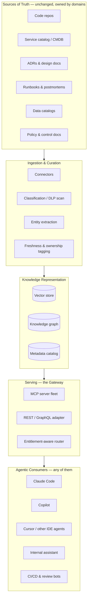

# The Knowledge Layer for AI-Native SDLC

**A deployment plan for 12,000 engineers that works no matter which agent they run.**

Prepared for: Engineering Leadership
Scope: Firmwide, all divisions
Horizon: 18–24 months to steady state

---

## Table of Contents

0. [Executive Summary](#00-executive-summary)
1. [Design Principles](#01-design-principles)
2. [What Actually Goes in the Layer](#02-what-actually-goes-in-the-layer)
3. [Reference Architecture](#03-reference-architecture)
4. [The Agent-Agnostic Interface](#04-the-agent-agnostic-interface)
5. [Organizing Around Structure That Won't Hold Still](#05-organizing-around-structure-that-wont-hold-still)
6. [Governance, Risk, and Controls](#06-governance-risk-and-controls)
7. [Phased Rollout](#07-phased-rollout)
8. [Getting 12,000 Developers to Actually Use It](#08-getting-12000-developers-to-actually-use-it)
9. [Measuring Whether It's Working](#09-measuring-whether-its-working)
10. [Risks and Mitigations](#10-risks-and-mitigations)
11. [Who Runs This](#11-who-runs-this)
12. [First 90 Days](#12-first-90-days)

---

## 00 · Executive Summary

The knowledge layer is the connective tissue between what the firm actually knows — who owns a service, why a system was built the way it was, what a control requires, what already broke last time — and whatever coding agent a developer happens to be running. Without it, agents are fluent but ignorant: technically correct output that duplicates an existing service, ignores an ownership boundary, or violates a control nobody told the model about. This memo treats the knowledge layer as a permanent internal platform, not a project: owned by a standing team, governed like a control rather than a wiki, and consumed through a protocol-neutral interface so we are never one procurement decision away from rebuilding it.

Five things have to be true for this to hold at 12,000-developer scale in a regulated bank:

- **Protocol over product.** Build to an open interface (MCP), not to Copilot or Claude Code or Cursor specifically — the agent landscape will keep changing under us.
- **Design for the org we have, not the org chart.** Ownership here is federated, matrixed, and frequently reorganized. Stewardship has to attach to the service, not the team name.
- **Govern it like a control.** Classification, entitlements, audit trail, and model-risk sign-off from day one — every AI suggestion needs to be explainable after the fact.
- **Freshness is a monitored metric, not an assumption.** Stale knowledge is worse than no knowledge — it's a confidently wrong agent.
- **Adoption is earned team by team.** 12,000 engineers across dozens of businesses will not adopt a mandate. They adopt something that makes their specific Tuesday better.

---

## 01 · Design Principles

Before architecture, the operating principles that architecture has to serve:

- **Protocol-first — no vendor lock-in.** Every capability is exposed through an open, model-agnostic interface first. Vendor-specific plugins are adapters on top, never the source of truth.
- **Tools, not text dumps — retrieval as callable operations.** Agents call `get_service_owner()` or `check_data_classification()`, not "here are 40 chunks, figure it out." Precision and auditability beat raw recall.
- **Federated content, central spine — ownership follows the entity.** A thin platform team owns the pipes. Every domain owns its own content, because they're the only ones who know if it's still true.
- **Freshness as SLA — decay is the default.** Untouched knowledge is treated as suspect after a defined window, surfaced with a staleness flag, and eventually retired — not left to quietly rot into a hallucination source.
- **Traceable by construction — every answer cites its source.** Source, version, and classification travel with every retrieval so a suggestion can be explained, audited, or challenged after the fact.
- **Prove, then scale — no big-bang rollout.** Two divisions and one knowledge domain prove the pattern before it becomes a firmwide expectation.

---

## 02 · What Actually Goes in the Layer

"Knowledge layer" is not a euphemism for a bigger vector database. It's seven distinct kinds of institutional knowledge, each with a different owner, refresh cadence, and sensitivity — treating them as one undifferentiated corpus is the single most common way these programs go generic and stale.

- **Structural — ownership & topology.** Service catalog, team ownership, on-call rotation, dependency and call graphs — the "who owns this and what does it talk to" layer agents need before touching anything.
- **Code & pattern — how we actually build here.** Repos, internal frameworks, proprietary DSLs, approved library/version lists, house style, and — just as important — a living list of deprecated patterns agents should stop suggesting.
- **Decision — why, not just how.** ADRs, RFC archives, design docs. The thing agents get wrong most often isn't syntax — it's re-litigating a decision that was already made and documented for a reason.
- **Operational — what already broke.** Runbooks, incident postmortems, known failure modes — so an agent proposing a fix doesn't recreate last quarter's outage.
- **Policy & control — what's allowed.** Secure coding standards, data-handling and classification rules, change-management and SOX control requirements, OSS licensing approvals.
- **Data — schemas & lineage.** Data dictionaries, lineage, and classification tags (Public / Internal / Confidential / MNPI) that gate what an agent is even allowed to retrieve.
- **Tribal — what's only in someone's head.** Exit-interview capture, "ask an expert" escalation paths, redacted office-hours transcripts — the highest-value, fastest-decaying category, and the one most programs skip.

---

## 03 · Reference Architecture

Five layers, each replaceable independently: sources of truth stay where they already live; nothing here asks a team to move their documentation into a new system of record.

*One gateway core, two thin protocol adapters (MCP + REST). New agent tools get an adapter, not a rebuild.*

The serving layer is the part that determines whether this is agent-agnostic in practice, not just in a slide. Retrieval is exposed as named, scoped operations — `get_service_owner(name)`, `search_code(query, repo)`, `get_related_incidents(service)`, `check_data_classification(dataset)` — rather than a single semantic-search endpoint that hands back raw chunks. Named tools are auditable (you can log exactly what was asked and answered), cheaper (no need to embed and re-rank an entire document for one fact), and safer to entitlement-check at the field level.

---

## 04 · The Agent-Agnostic Interface

Twelve thousand developers will not standardize on one agent, and shouldn't have to — different teams have different licensing, different IDEs, different regulatory review status per tool. The interface is where agnosticism actually lives.

### Why MCP as the primary protocol

The Model Context Protocol is rapidly becoming the common interface for connecting agents to external context and tools, with growing multi-vendor support. Standardizing on it means building the knowledge layer once and letting any MCP-capable agent connect to it, rather than writing a bespoke plugin per tool that has to be re-certified every time procurement approves something new.

### Gateway core, protocol adapters at the edge

All business logic — retrieval, entitlement enforcement, classification checks, audit logging — lives in one internal **Knowledge Gateway** service. MCP servers and a REST/GraphQL surface are both thin adapters over that same core. When a tool that doesn't yet speak MCP needs to be supported, or MCP itself evolves, the team writes an adapter, not new logic — the gateway is never duplicated per tool.

### Identity travels with every call

Every request carries the developer's existing SSO identity through to the gateway, which scopes results to what that person is already entitled to see. The agent is never a privilege-escalation path — if a developer can't read a repo or dataset today, no agent acting on their behalf can either.

| Example server | Exposes | Typical caller |
|---|---|---|
| `mcp-service-catalog` | Ownership, on-call, dependency graph | Any coding agent, incident-response bots |
| `mcp-code-search` | Semantic + symbol search across repos | IDE agents, review bots |
| `mcp-adr` | Architecture decisions, RFC archive | Design/review agents |
| `mcp-runbooks` | Runbooks, postmortems, known failure modes | Ops & on-call agents |
| `mcp-policy` | Coding standards, control & licensing rules | Review & CI agents |
| `mcp-data-catalog` | Schemas, lineage, classification tags | Data & analytics agents |

---

## 05 · Organizing Around Structure That Won't Hold Still

A firm this size does not have one clean owner for anything, and it reorganizes constantly. Any model that assumes stable team boundaries breaks within two quarters. The fix is to stop attaching stewardship to a team name and attach it to the entity being described.

### Central Knowledge Platform team — small and permanent

Owns the gateway, the ingestion pipelines, the entitlement integration, and the standards every domain connector has to meet. Does not own content correctness — that's structurally not scalable, and it removes the incentive for domains to keep their own knowledge current.

### Federated stewardship, decoupled from the org chart

Every service, repo, and dataset in the metadata catalog carries a `steward` field — a role, not a name, resolved against the existing service catalog or CMDB. When a service transfers between teams during a reorg, one field updates; nothing about the knowledge itself needs migrating. Stewardship is framed as an extension of existing service-ownership responsibility, not a new job description, and shows up on the same engineering-excellence scorecard as on-call and service ownership already do — no unfunded mandate, no separate approval chain to opt in.

### Governance council — where ambiguity gets adjudicated

A monthly cross-division working group — engineering leadership from each major division, plus compliance, model risk, and security — owns the decisions that federated stewards can't make alone: what new source connectors get approved, how classification disputes get resolved, when a knowledge domain is mature enough to expand to the next division.

> **Why this matters here specifically:** Reorgs are a constant at this scale, not an edge case. A model that survives them has to make "who's accountable for this" a property of the data, not a fact someone has to remember to update.

---

## 06 · Governance, Risk, and Controls

This is a regulated bank; the knowledge layer touches source code, deal data, and potentially MNPI. It gets built as a control from the outset, not retrofitted after an incident.

- **Classification at ingestion.** Every source is tagged Public / Internal / Confidential / MNPI before indexing. MNPI-tagged content is excluded from broad retrieval by default and respects existing information barriers between desks and deal teams.
- **Fold into existing Model Risk Management.** The gateway's retrieval and ranking logic is treated as a model subject to periodic validation under the firm's existing MRM framework — not a piece of infrastructure that quietly sits outside it.
- **Audit every retrieval.** Who (developer + agent identity), what was retrieved, which source version, and — where feasible — what it was used for downstream. This is the difference between "the agent suggested it" and being able to explain why, after the fact.
- **Treat ingested content as untrusted input.** Documents get sanitized and validated before indexing; the retrieval layer gets red-teamed for prompt injection via poisoned or malicious source content, the same way any external input would be.
- **Legal and compliance sign-off at every phase gate**, not only at initial launch — scope expansion is itself a decision point, not a formality.

---

## 07 · Phased Rollout

No big-bang mandate to 12,000 developers. Each phase has to earn the next one on its own results.

| Phase | Duration | Scope | Exit criteria |
|---|---|---|---|
| **0 · Discovery** | ~1 quarter | Source audit, classification framework, charter with named exec + compliance/MRM co-sponsor | Pilot domain, divisions, and success metrics agreed and baselined |
| **1 · Pilot** | ~1 quarter | 1–2 knowledge domains, one gateway + MCP server, one agent tool, 2 divisions, 200–500 developers | Measurable lift on baselined metrics; governance council go/no-go |
| **2 · Expand** | ~2 quarters | +3–4 domains, 2nd/3rd agent tool connected, steward network formalized, several thousand developers | Adoption playbook published; freshness SLAs holding across domains |
| **3 · Scale** | ~2 quarters | Firmwide availability, self-service connector onboarding, chargeback/showback model live | All 12,000 developers have access; steady-state ownership handed to platform team |
| **4 · Steady state** | Ongoing | Usage-driven deepening, quarterly MRM revalidation, deprecation workflow for stale content | Continuous — no further "launch" events, only reviews |

---

## 08 · Getting 12,000 Developers to Actually Use It

A platform nobody asked for gets ignored regardless of how well it's built. Adoption at this scale is earned, not mandated.

- **Lead with wins, not with messaging.** The pilot needs 3–4 visible, specific results — faster ramp-up on an unfamiliar service, measurably fewer "who owns this" threads in the team's chat channel — before any firmwide communication goes out.
- **Champions per division.** One or two engineers trained during the pilot become the local point of contact and the first line of feedback for their division, rather than routing everything through the central team.
- **Contribution as low-friction as a pull request**, because it should literally be one — against the same source of truth the team already maintains, not a parallel wiki edit nobody remembers to do.
- **Embed in onboarding** so new hires meet the knowledge layer as the normal way to ramp up on a service, not as an optional add-on discovered later.
- **Visible executive sponsorship at every phase transition**, not just at initial launch — the signal that this is a standing priority, not last quarter's initiative.

---

## 09 · Measuring Whether It's Working

| Category | Metric | Signal |
|---|---|---|
| **Adoption** | Weekly active developers with an agent connected to the gateway | Rising share of the 12,000, phase over phase |
| **Quality** | PR rework rate and defect-escape rate on AI-assisted changes | At or below the non-AI-assisted baseline |
| **Velocity** | Cycle time / lead time for change | Measurable reduction on knowledge-heavy tasks |
| **Knowledge health** | % of services with a named steward and content refreshed within SLA | >90% within core domains by Phase 3 |
| **Trust & governance** | % of retrievals fully logged; control violations traced to AI suggestions | 100% logged; zero material violations |
| **Cost** | Infra cost per active developer vs. estimated hours saved | Positive and improving each phase |

---

## 10 · Risks and Mitigations

| Risk | Why it bites here specifically | Mitigation |
|---|---|---|
| **MNPI / data leakage** | Information barriers exist for a reason; an agent is a new path across them if unchecked | Classification at ingestion, entitlement-scoped retrieval, red-teamed gateway |
| **Federated hoarding & stale silos** | No natural incentive to maintain shared knowledge under deadline pressure | Stewardship on the eng-excellence scorecard, tied to the entity not the team name |
| **Vendor lock-in** | Agent tooling market is moving fast; today's default won't be tomorrow's | Protocol-first (MCP), gateway core with thin adapters |
| **Hallucination from stale docs** | Confidently wrong is worse than silent — especially in production code | Freshness SLAs, mandatory source citation, staleness flags surfaced to the agent |
| **Change fatigue** | 12,000 developers have seen initiatives come and go | Phased, win-led rollout; no big-bang mandate |
| **Reorg churn breaking ownership** | Reorganizations are routine, not exceptional, at this scale | Stewardship attached to service/domain metadata, not to a person or team name |
| **Regulatory exposure** | Retrieval logic influences production code in a regulated business | Folded into existing Model Risk Management from day one |

---

## 11 · Who Runs This

### Central Knowledge Platform team (permanent)

- Platform lead — owns the roadmap and the governance council relationship
- Retrieval / ML engineers — ranking, embeddings, tool-calling design
- Knowledge-graph & data engineers — ingestion pipelines, entity extraction, freshness tooling
- Security & entitlements engineer — identity propagation, classification enforcement
- Compliance / model-risk liaison — the standing bridge to MRM and legal
- Developer-enablement lead — champions network, onboarding, feedback loop

### Federated (layered on existing roles, not new headcount)

- Knowledge stewards — one per service/domain cluster, an extension of existing service ownership
- Governance council members — senior division reps plus compliance, model risk, and security

---

## 12 · First 90 Days

1. Charter the initiative with a named executive sponsor and a compliance/model-risk co-sponsor.
2. Inventory sources of truth: what exists, who owns it today, current quality and classification.
3. Stand up a 5–8 person central platform team.
4. Pick the pilot: 1–2 knowledge domains, 2 divisions, 200–500 developers, one agent tool.
5. Build the gateway core, the first MCP server, and the entitlement integration.
6. Baseline the success metrics before the pilot goes live — not after.
7. Recruit the first cohort of knowledge stewards and division champions.
8. Run the pilot for one quarter; bring results to the governance council for a go/no-go on Phase 2 scope.

---

*Internal working draft — architecture and phase gates subject to governance council review.*
